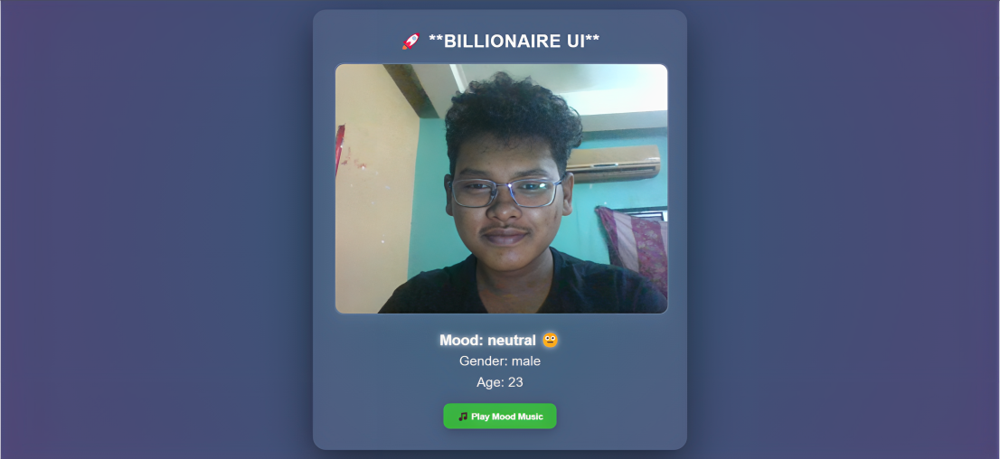

# Emotion UI



## 🚀 Overview

Emotion UI is a cutting-edge application that uses face detection and emotion recognition technology to dynamically adapt the user interface based on the user's emotional state. The app detects facial expressions in real-time and transforms the UI to match the user's mood, creating a personalized and responsive user experience.

## ✨ Features

- **Real-time Facial Emotion Detection**: Accurately identifies 7 different emotions (happy, sad, angry, surprised, neutral, fearful, disgusted)
- **Dynamic UI Adaptation**: Interface colors and styles change to match detected emotions
- **Age & Gender Detection**: Additional user attributes detection
- **Mood-Based Music Player**: Automatically plays music that matches your current emotion
- **Responsive Design**: Works on various screen sizes and devices

## 🛠️ Technologies Used

- **React**: Frontend library for building the user interface
- **face-api.js**: ML models for facial detection and expression recognition
- **Material UI**: Component library for styled UI elements
- **Framer Motion**: Animation library for smooth transitions
- **Vite**: Fast and efficient build tool

## 🔧 Installation

1. Clone the repository:
   ```bash
   git clone https://github.com/NabarupDev/Emotion-Ui.git
   ```

2. Install dependencies:
   ```bash
   npm install
   ```

3. Start development server:
   ```bash
   npm run dev
   ```

4. Build for production:
   ```bash
   npm run build
   ```

## 🎯 How It Works

1. The app accesses your webcam (with permission)
2. Face-api.js models detect your face and analyze expressions
3. The dominant emotion is determined from the expression data
4. UI theme adapts in real-time to match the detected emotion
5. Optional mood music plays based on your emotional state

## 📋 Requirements

- Modern web browser with JavaScript enabled
- Webcam access
- Internet connection for initial loading of models

## 🔐 Privacy

- All facial processing happens locally in your browser
- No images or personal data are sent to any server
- No data is stored beyond the current session

## 📝 License

This project is licensed under the MIT License - see the [LICENSE](LICENSE) file for details.

## 🤝 Contributing

Contributions are welcome! Please feel free to submit a Pull Request.

1. Fork the project
2. Create your feature branch (`git checkout -b feature/amazing-feature`)
3. Commit your changes (`git commit -m 'Add some amazing feature'`)
4. Push to the branch (`git push origin feature/amazing-feature`)
5. Open a Pull Request

## 📞 Contact

Your Name - [@Nabarup_Roy](https://x.com/Nabarup_Roy) - nabaruproy.dev@gmail.com

Project Link: [https://github.com/NabarupDev/emotion-ui](https://github.com/NabarupDev/Emotion-Ui)
